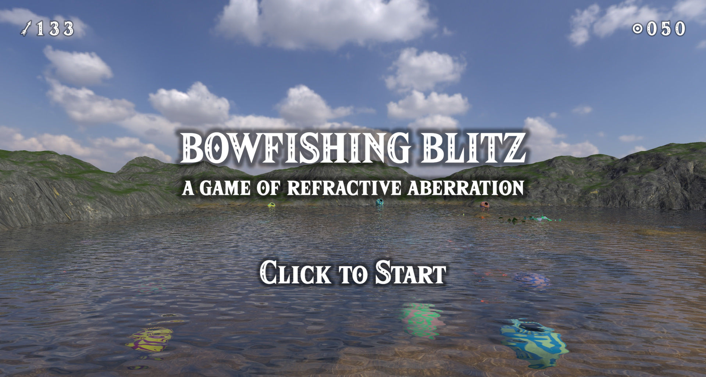

Bowfishing Blitz: A Game of Refractive Aberration
=================================================

A tribute to the minigames of the Zelda series, and a demonstration of a new technique for real-time water refraction.
Made for Acerola Jam 0.

**Objective:** Smash as many pots as possible in three laps of the pond before time runs out.
Be careful, *water refracts light, but it does **not** refract arrows.* 
When shooting, remember that objects in water are deeper than they appear, and adjust your aim accordingly. 

[Builds available on itch.io](https://george-steel.itch.io/bowfishing-blitz).

Credits
-------

Copyright 2024 by George Steel. Available under the [Mozilla Public License 2.0](./LICENSE.txt).

[Background music](https://incompetech.com/music/royalty-free/index.html?isrc=USUAN1300032) by Kevin MacLeod used under the [Creative Commons Attribution 3.0 license](http://creativecommons.org/licenses/by/3.0/).

Rendering pipeline setup inspired by [Jasper's excellent video](https://www.youtube.com/watch?v=By7qcgaqGI4) on deferred lighting, transmission, and decals.

Key insights into the nature of clip space and vertex shaders inspired by [Manifold Garden](https://store.steampowered.com/app/473950/Manifold_Garden/).

Additional CC0 textures and audio listed in [`assets/SOURCES.md`](./assets/SOURCES.md).

<p style="margin-top: 4em"></p>

Introducing Clip-Space Planar Refraction
=========================================

This game was created as a demonstration of how to adapt a deferred rendering pipeline in order to achieve physically-accurate planar refraction
without the heavy computational cost of raytracing (commonly believed to be required for this effect).
By performing a form of non-perspective path tracing on each vertex of the underwater geometry to produce clip space positions,
we can use normal triangle rasterization to render an accurate image refracted by flat water, without needing to raytrace each fragment.
Unlike purely screen-space techniques, this is fully capable of rendering refracted geometry that would not otherwise be visible to the camera.

In order extend this technique to efficiently wavy water,
we can then use a flat-water refracted image as the basis for screen-space effect similar to parallax mapping,
projecting the true refracted ray path directions into planar-refracted space,
combining these projected directions with the planar-refracted distance buffer,
to find a displaced point to sample the transmitted colour from on the underwater image.
As this displacement tends to be fairly small (unlike the difference between view direction and refracted direction),
this makes it viable to use the actual refracted rays for transmission sampling without a large fraction of them going offscreen
(a problem which forces most games implementing water transmission to use non-physical forms of distortion which nave no planar component).


Clip space and paths
--------------------

In order to convert a traditionally raytraced technique (refraction) to a rasterized one,
we must first understand the relationship between the two approaches.
Both rendering techniques are, at their core, ways of finding optical paths
from the the camera to scene geometry for every direction in the camera's field of view.
In raytracing, we use a pull approach, processing pixels independently and finding the intersection of a pixel's ray with the scene by
searching through an indexed representation of the scene in world-space (of which many possibilities exist).
This as an extremely flexible approach and can deal with paths that bend or reflect by continuing the search with a new origin and direction.

Rasterizing, on the other hand, solves the same problem by using a push approach,
breaking a up scene up into worldspace triangles and then calculating which pixels each triangle can reach.
By merging the results for all triangles (taking the shortest path for each pixel), we get a path for each pixel that can reach the scene.
This significantly reduces the processing requirements needed, as there is no need to search an index every pixel.
Pathfinding (which is usually quite simple) is only done for each triangle vertex by a vertex shader,
and the results are simply interpolated between when passing data to fragment shaders.

To represent an optical path between the camera and a vertex, we use a coordinate system called clip space.
Each path is described by a four-vector `vec4f(x, y, z, w)`,
where `x/w`, `y/w`, and `sign(z/w)` represent the direction of the path as it leaves the camera (where `z/w` is positive, `x/w` and `y/w` determine pixel position),
and `w/z` (possibly adjusted for depth clipping) is a distance metric that represents the length of the path (used to select the shortest path and accumulated in the distance buffer). 
Several valid choices of distance metric exist (such as total Euclidean distance, time-of-flight, horizontal parallax, and vertical parallax), all of which agree for direct straight-line paths.
In order to keep the math simple, we will be using horizontal parallax as our distance metric.

In the case of straight lines through empty space, direct paths can be found through the familiar perspective transformation,
with the path to each vertex determined (as a clip-space vector) by

```wgsl
clip_pos = camera_matrix * vec4f(world_pos, 1.0);
```

where `camera_matrix` maps the direction the camera is pointing to `w`, perpendicular directions to `x` and `y` (scaled for field of view) and a constant to `z`.
When applied to all triangles, this this results in each pixel being covered by the closest triangle that its ray passes through.

In order to simulate to additional, indirect optical paths, we can render the triangles of a scene additional times,
tracing a different path (with a different clip-space representation) with each repetition. 
In order to correctly merge the results of these paths with the direct paths,
we render the indirect paths in separate passes to intermediate textures,
using the results in the fragment shader or lighting shader of the main pass in order to arrive at the pixel's final colour.

This is a very common technique used to render reflections from flat, mirror-like surfaces,
as we can find those path using the same type of perspective transformations as direct paths
(using the same shaders with different parameters) by reflecting the camera across the mirror.


Virtual space and refracted paths
---------------------------------

Although the case of reflection above is simple enough to calculate by just reflecting the camera,
When dealing with more complex indirect paths, it is helpful to introduce an additional, intermediate coordinate system: virtual image space.

We defined a path's representation in virtual space as the endpoint (in world space) of a straight path
with the same origin (the camera), initial direction, and length as the path in question.
This is closely related to clip space, but somewhat more generic, for all paths (both direct and indirect),

```wgsl
clip_pos = camera_matrix * vec4f(virtual_pos, 1.0);
```
In the case of reflection in a planar mirror discussed above, the virtual position of a point's reflection is
the point's world-space position inverted across the mirror plane,
which is where the reflection appears to be when looking "through" the mirror.
As this inversion can also be represented as a matrix, composing such a it with the original camera produces the reflected camera discussed above.

Although the transformation from world space to virtual space of a planar reflection is linear can be represented as a matrix,
nonlinear transformations such as curved reflections and planar refraction are also possible, and, although they do not preserve triangles exactly,
will render with reasonable accuracy as long as they are smooth at the scale of the triangles being transformed,
which are often approximations of curved geometry themselves
(and too-large triangles that are meant to be truly flat can be dealt with using tessellation). 

In the case of planar refraction into flat water, the optical path from the camera to a point
is bent downwards (towards the surface's vertical normal) as it crosses the water's surface.
As this bending is purely vertical, horizontal parallax (which we use as our path length metric) is unaffected,
putting the point's position in virtual space (for the this refracted path) directly above the point's world-space position,
somewhere between the point and the water's surface directly above it.

To find the position where the path intersects the water's surface (and thus the virtual position)
we solve for the point where the path directions match Snell's law of refraction:
```wgsl
sin(angle_from_vertical_above) == ior * sin(angle_from_vertical_below);
```
For a point `world_depth` below the water, and a camera `horiz_dist` away horizontally and `cam_height` above the water,
let `virt_depth` be the depth of the point's virtual position below the water. We then have
```wgsl
1/tan(angle_from_vertical_above) == (cam_height + virt_depth) / horiz_dist;
1/tan(angle_from_vertical_below) == (world_depth / vert_depth) * (cam_height + virt_depth) / horiz_dist;
```
Applying trigonometry, we combine these with Snell's law to get
```wgsl
pow(world_depth / virt_depth, 2) == (pow(ior, 2) - 1) * pow(horiz_dist / (cam_height + virt_depth), 2) + pow(ior, 2);
```
which we can solve to find `virt_depth`. 

Since the solution to this quartic equation is extremely messy, to find `virt_depth` in shader code,
we approximate a solution numerically.
Since our equation above is already in the form of a convergent fixed point,
we can use iterated evaluation starting from an crude initial estimate to approximate the solution.
Defining `depth_ratio = world_depth / virt depth` and letting `ior = 1.33` (water's index of refraction) gives us the following function:

```wgsl
fn virtual_depth(horiz_dist: f32, cam_height: f32, world_depth: f32) -> f32 {
    // Initial estimate found by fitting a simple curve in Desmos
    let x = horiz_dist / (world_depth + 3 * cam_height);
    let init_ratio = 1.33 * (x * x + 1);

    // Iterate the refraction equation to converge on the fixed point
    // 4 iterations gets close enough to the true value to look extremely convincing
    var depth_ratio: f32 = init_ratio; 
    var oblique = horiz_dist / (abs(world_depth) / depth_ratio  + cam_height);
    depth_ratio = sqrt(0.77 * oblique * oblique + 1.77);
    oblique = horiz_dist / (abs(world_depth) / depth_ratio + cam_height);
    depth_ratio = sqrt(0.77 * oblique * oblique + 1.77);
    oblique = horiz_dist / (abs(world_depth) / depth_ratio + cam_height);
    depth_ratio = sqrt(0.77 * oblique * oblique + 1.77);
    oblique = horiz_dist / (abs(world_depth) / depth_ratio + cam_height);
    depth_ratio = sqrt(0.77 * oblique * oblique + 1.77);

    // return 
    return depth / ratio;
}

fn refracted_virt_pos(world_pos: vec3f, water_height: f32) -> vec3f {
    // camera is a uniform
    let cam_dist = length(world_pos.xy - camera.world_pos.xy);
    let virt_depth = virtual_depth(cam_dist, camera.world_pos.z - water_height, world_pos.z - water_height);
    return vec3f(world_pos.xy, water_height + virt_depth);
}
```

By taking the absolute value of world_depth when calculating our virtual depth,
this gives a sensible (although technically non-physical) extrapolation of virtual position for points above water. 
Using this, we can render refracted triangles that cross the water's surface by using this function to find the virtual positions of the vertices, 
then discarding the above-water part of the triangle in the fragment shader.

In order to perform deferred lighting calculations for such an image,
we need to recover the world-space position of the fragment, along with the optical path direction at the fragment.
We start with the usual technique of passing the pixel position and depth-buffer value through the inverted camera matrix,
recovering the virtual position of the point.
While it would be possible to calculate the fragment's world-space position using a single iteration of the virtual depth equation above,
this game uses the simpler technique of storing the ratio between world-space and virtual depths in a gbuffer.

By using the techniques above and applying some simple lighting, we end up with a refracted image of under geometry
(note how further-away objects appear flatter as the angle of incidence becomes shallower).


Ripples and screen-space distortion
-----------------------------------

In order to render refraction from a wavy surface,
we start with a planar refracted image (plus its corresponding distance buffer) made using the technique above
and then sample it using a screen-space distortion technique in order to obtain the transmitted colour for each fragment of the water's surface.

In the lighting shader, when we processing water fragments,
we calculated the actual refracted direction of a path from the camera (using the fragment's true normal),
and then project that direction into planar-refracted virtual space by shrinking its z component by the
same amount that we shrink the z component of the planar-refracted direct
(trivial to calculate with Snell's law using the `refract` WGSL builtin).

```wgsl
let look_dir_above = normalize(water_world_pos - camera.world_pos);

let refr_dir_planar = refract(look_dir, vec3f(0.0, 0.0, 1.0), 0.75);
let virt_z_ratio = (look_dir.z / refr_dir_planar.z) * (length(refr_dir_planar.xy) / length(look_dir.xy));

let refr_dir_world = refract(look_dir, water_normal, 0.75);
let refr_dir_virt = normalize(vec3f(refr_dir_world.xy, refr_dir_world.z * virt_z_ratio)); 
```

We then find the length of the underwater portion of the planar refracted path by
sampling using the underwater distance buffer at the pixel's location.
Note that we use `textureSampleLevel` here instead of `textureLoad` as it allows the underwater image to be rendered at reduced resolution.

```wgsl
// this line is part of recovering water_world_pos, it is included here for clarity
let dist_val = textureLoad(dist_buf, pixel_xy, 0); // a depth buffer stores clip_near / distance
// ... 
let uw_dist_val = textureSampleLevel(water_dist_buf, water_sampler, pixel_uv, 0.0);
let uw_dist_planar = length(water_world_pos - camera.world_pos) * (dist_val / uw_dist_val - 1.0);
```

In order to find the correct point on the underwater image to sample,
we use a similar technique to parallax mapping where we take the planar-refracted underwater distance (`uw_dist_planar`)
and apply it to the virtual refracted direction (`refr_dir_virt`) to find our sampling point in virtual space.
We can then apply the camera matrix to this point,
taking the xy coordinates to get a point on the underwater image to sample.
For small ripples, this tends to be quite close to water's pixel,
minimizing the chance of going off-screen.
```wgsl
let refr_point_virt = water_world_pos + uw_dist_planar * refr__dir_virt; // simple parallax mapping
let refr_point_clip = camera.matrix * vec4f(refr_point_virt, 1.0);
let refr_point_uv = vec2f(0.5, -0.5) * (refr_clip.xy / refr_clip.w) + 0.5;

let trans_color = textureSampleLevel(water_image_buf, water_sampler, refr_point_uv, 0.0).xyz;
```

Combining this transmitted colour with the reflected colour (in this case, sampled from a skybox)
using a Fresnel factor gives us the fragment's final colour as seen by the camera.
Using the same frame as the under image above, this gives us the following final frame.


Since we used used simple parallax mapping (only sampling the distance buffer once)
to find the correct point on the planar-refracted image,
the ripples are not quite accurate around edges of objects (such as the blue and green pot in the center)
or when showing transmitted geometry nearly parallel to rays from the camera
(in the distance, although this is obscured by reflection due to the shallow angle and high Fresnel factor),
but is close enough to look convincing, especially when the waves are animated.

If additional accuracy is desired (at the cost of additional processing load),
one could instead replace the simple parallax mapping step with parallax occlusion mapping,
marching along the refracted path through the underwater distance buffer
to find the true intersection of the refracted ray and the underwater scene.
For the purposes of this game, this was not required.

----

By first rendering a planar-refracted underwater image,
using vertex shaders to draw triangles at their virtual positions,
then parallax mapping the resulting image to account for waves,
we have a very efficient way to render a properly refracted underwater scene
without the need for the overhead of raytracing.
When testing this game at 4k resolution on a laptop GTX 1050Ti,
render times averaged at approximately 7ms/frame,
less than half of the 16ms limit for 60fps.

Note
----

Although the game and its source code is licensed under the [Mozilla Public License 2.0](./LICENSE.txt),
the code samples in this README may additionally be used under the MIT OR APACHE-2.0 licenses.